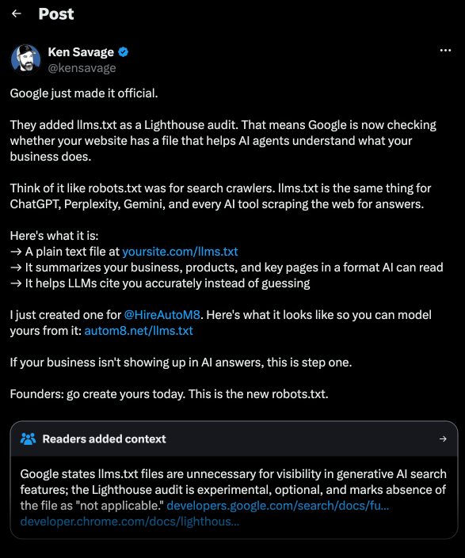
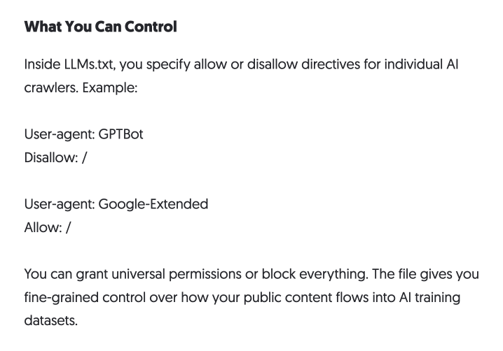

If the spam emails I get are anything to go by, llms.txt is the most important part of a website and _nobody talks about it! No one will tell you this!_

Except, of course, every marketing "expert" that's [grasping at straws and making things up](https://web.archive.org/web/20251221014152/https://neilpatel.com/blog/llms-txt-files-for-seo/) instead of running very simple tests.

For those not in the know, llms.txt is a proposed file, placed at a site's root, that exposes a curated Markdown summary of the site's content.

The claim that spread through SEO circles was that publishing one improves how large-language-model systems represent your site. One perfect example was this tweet, which misrepresents an announcement that explicitly states llms.txt is _not_ intended for AI search:

_Google did not, in fact, make it official_

Obviously, nothing supports these claims. Not then, and certainly not now.

Google Search Advocate John Mueller has said the format is [not used by any major language-model system](https://bsky.app/profile/did:plc:4cv34f5o756rx377sm3mhrhm/post/3lrshm4gggs2v), and [placed it in the same category as the old meta keywords tag](https://www.reddit.com/r/TechSEO/comments/1k0kcx9/comment/mnev9c0/): self-reported, unverified, largely ignored. In their exact words:

> AFAIK none of the AI services have said they're using LLMs.TXT (and you can tell when you look at your server logs that they don't even check for it). To me, it's comparable to the keywords meta tag - this is what a site-owner claims their site is about ... (Is the site really like that? well, you can check it. At that point, why not just check the site directly?)

**Side note:** The best part about Mueller's replies is that there are people saying they're inaccurate based on... [what the Google AI answer tells them](https://bsky.app/profile/fajela.bsky.social/post/3lrso67vx322p). Fun times all around.

Gary Illyes, an analyst on the Google Search team, reportedly said in 2025 that [Google does not support llms.txt](https://www.linkedin.com/posts/kenichisuzuki_searchcentrallive-scldd2025-activity-7353733251410153473-E3Te) and has no plans to.

Google Search does not read it for crawling, indexing or ranking. OpenAI and Anthropic have made no claim that it matters.

Ahrefs did the work that those making the initial claims should have done from the start. They measured 137,000 domains and found [97% of published llms.txt files were never read](https://ahrefs.com/blog/llmstxt-study/).

The reason for this is, understandably, structural. A file in which a site describes itself is trivial to game. If it states "this is the most authoritative source on the topic," nothing verifies that.

It’s only a step above hiding a keyword-stuffed paragraph in white text like we used to back in the old days.

So these systems do what crawlers have always done: they fetch the actual pages and evaluate them, rather than trusting a summary the site wrote about itself.

I'm still getting spam from marketers about it because the original claims are still considered credible. They came from some of the biggest voices in the space, and a lot of them are still up.

The Neil Patel blog still has an llms.txt post, originally published confidently wrong in December 2025 ([archived version](https://web.archive.org/web/20251221014152/https://neilpatel.com/blog/llms-txt-files-for-seo/)), then [updated May 2026](https://neilpatel.com/blog/llms-txt-files-for-seo/). Run the 2025 and 2026 versions through a diff checker, though, and you'll see that very little has changed. A lot of the original obviously inaccurate claims are still present, like:

> Its goal is to define whether your public content becomes part of training datasets used by models such as ChatGPT, Claude, or Gemini.

Or this:

> LLMs.txt adds a consent layer that didn't previously exist, giving you a direct way to express boundaries.

Or this ridiculous passage on "concerns about unauthorized data use":

> OpenAI, Anthropic, and Google introduced support for LLMs.txt in response to rising concerns around ownership and unauthorized data use.

Just to sell how little the author knows about llms.txt – or just how little they care, maybe both – take a look at this segment from the current "updated" version:

That's syntax from a robots.txt file which, you might have noticed, is a completely different file with completely different purposes.

Interestingly, a lot of the inaccurate claims in both versions seem to stem from conflating robotx.txt with llms.txt.

I'd wager the original article brought in a ton of traffic, and the site owners value that over accuracy. Or maybe it was just too much work. Either way, it's still being used by the worst marketers to try and hawk their services in my spam folder.

The only use case for llms.txt that holds up is with an agent working through your site, reading documentation to complete a task. It benefits from a neat index of what exists and where.

That's a documentation problem, local to the site and relevant only after arrival. It is not marketing, and it's definitively not a ranking signal.

If you maintain docs, llms.txt may be worth writing. If you publish one to be seen, you're wasting your time.
