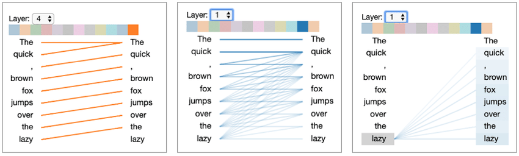

Technical content is not meant to be read, not really.

Look at this heatmap from a [2006 study](https://www.nngroup.com/articles/f-shaped-pattern-reading-web-content-discovered/) that used eye-tracking to analyze people's reading patterns:


_Source: Nielsen Norman Group_

That's called the F-shaped reading pattern, and it shows that people only read the top of the page closely, then skim down the left margin.

That's general reading, but anyone who's worked in software will tell you skimming only gets worse with technical material.

Documentation, blog posts, onboarding material, all that stands between developers and what they're trying to build. You can use it to get them there faster, or you can stand in their way.

Either way, though, you'll come up against the same issue, which is that they absolutely do not want to read.

Documentation has only ever been a means to an end, which is why they [latched onto LLMs so quickly](https://www.gitbook.com/blog/ai-docs-data-2025).

Your only path forward is to help them get from A to B as quickly as possible. So quickly, in fact, that you're practically invisible in the process. Like a great OS, if you can stay out of the user's way long enough that they forget you're there, you're crushing it.

This all puts us in an awkward position because, even though people aren't reading what we write, we still _have_ to write. After all, even the machines have to get their information from _somewhere_. And in their own way, [they're not reading either](https://www.researchgate.net/figure/Attention-head-view-for-GPT-2-for-the-input-text-The-quick-brown-fox-jumps-over-the_fig1_335784229).


_Source: [Jesse Vig](https://www.researchgate.net/profile/Jesse-Vig)_

Luckily, the rules that make technical writing a success for people are the same ones that make it work for everything else.

Let's go over how to engineer resources that make information easy to extract so they serve whatever comes looking for it.

## Put the task first

Starting things off by providing an extensive background, explaining the architecture or, heaven forbid, your philosphy, immediately slows things to a crawl.

Begin with what the user came to do.

A weak opening is:

> The deployment service provides a flexible system for managing application releases across multiple environments.

A better opening would be:

> Run this command to deploy your application to production.

Users can learn how the system works after they' ha've made progress. Early explanations create friction before the user has received any value.

For task-based documentation, use this order:

1. State the outcome.
2. Show the action.
3. Show the expected result.
4. Explain the details.
5. Cover exceptions and alternatives.

This gives a direct route to whoever needs only the action, while preserving depth for whoever needs the full explanation.

## Make every example safe to copy to production

Users will copy code without reading the text around it, and you'll need to plan for that.

A code sample should include everything required to run it:

- Imports
- Dependencies
- Placeholder values
- Authentication setup
- Required configuration
- The command used to execute it
- The expected output

Don't assume the reader has completed an earlier tutorial. Do not assume they know which directory to use. Do not hide a required step three paragraphs above the example.

Consider this command:

```bash
deploy release
```

It looks simple, but it may depend on several unstated conditions:

- The deployment tool is installed.
- The user is authenticated.
- A configuration file exists.
- The command is being run from the project directory.
- A production environment has been created.

If any of those conditions are missing, it won't work and the reader will blame _you_.

Use this version to make the setup visible:

```bash
npm install --global acme-deploy
acme-deploy login
cd my-project
acme-deploy release --environment production
```

Then show the result:

```text
Deployment completed: release-184
```

A user should be able to distinguish success from failure immediately.

## Put warnings where users make mistakes

A warning at the top of a long page will not protect someone running a command near the bottom.

Place critical information next to the action it affects.

Instead of this:

> Warning: Deleting an environment permanently removes its stored configuration.

Followed by several sections and then:

```bash
tool environments delete production
```

Write this:

> ```bash
> tool environments delete production
> ```

> **This permanently deletes the environment and its stored configuration. It cannot be undone.**

Warnings should be specific. Explain what will happen and what will be lost, and whether the action can be reversed.

Don't mark every note as critical because when everything is flagged as important, nothing is.

## Write in the user’s language

Internal terminology often differs from the words used in real queries.

- Your product may call something a “delivery endpoint” while users call it a webhook URL.
- Your engineering team may say “invalidate an object” but users search for “clear the cache.”
- Your interface may say “create a credential” whereas users want to know how to generate an API key.

Use the official term, but include the common alternatives.

For example:

> Create an API credential, sometimes called an API key or access token.

This improves comprehension and makes the page easier to find.

Useful language comes from real usage:

- Support tickets
- Search queries
- Forum posts
- Sales questions
- Chat logs
- Issue trackers
- Error messages pasted into search

Don't guess how users describe a problem when you can inspect the words they already use.

## Treat error messages as documentation

An error message may be the only documentation a user reads, and they're going to be frustrated by the time they get to it, so you have to pay extra attention here.

“Invalid request” is near useless because it confirms failure without explaining it.

A useful error message answers three questions:

1. What didn't work?
2. Why didn't it work?
3. What should the user do next?

Weak:

```text
Authentication failed.
```

Better:

```text
Authentication failed because the API token expired on July 12.
Create a new token in Settings > API access, then run the command again.
```

Include the invalid value when it is safe to do so.

Weak:

```text
Port is invalid.
```

Better:

```text
Port "eight-thousand" is invalid. Enter a number from 1 to 65535, such as 8080.
```

You should review product errors just as closely as documentation pages. Improving one common error can prevent a large volume of repeated failures.

## Make exact errors searchable

When an unfamiliar error appears, the entire message is often used as a search query.

Give important errors stable, distinctive wording.

Avoid messages such as:

```text
Something went wrong.
```

Use messages such as:

```text
CONFIG_PATH_NOT_FOUND: No configuration file exists at ./config/app.yaml
```

Then publish a page containing that exact message.

The page should explain:

- What the error means
- Its common causes
- How to confirm the cause
- The fastest fix
- Related errors

Don't change error wording casually. When the product and documentation use different text, search no longer connects the query to the right page.

## Make every page work as an entry point

Many users won't enter through the documentation homepage or your blog archive. Instead, they arrive at a deeply nested page directly from a search result, a shared link, or a single retrieved section. You need to ensure that that page makes sense by itself.

A standalone page should clearly identify:

- The task it solves
- The product or component involved
- Required prerequisites
- The expected starting state
- The next useful action

Avoid introductions such as:

> After completing the previous step, configure the connection.

The reader may have no idea what the previous step was.

Write:

> Before configuring the connection, create a project and generate an access token.

Link to those tasks without forcing users to follow an entire sequence.

## Design pages for fast navigation

Readers look for anchors that mark where the useful parts are.

Provide clear ones using:

- Descriptive headings
- Short paragraphs
- Numbered procedures
- Bulleted requirements
- Code blocks
- Tables for comparisons
- Bold text for critical terms
- Clear links

Headings should describe decisions or actions.

Weak headings:

- Overview
- Details
- Additional information
- Configuration

Better headings:

- Install the command-line tool
- Connect to a private database
- Choose a retry policy
- Fix an expired certificate

Front-load important words.

Weak:

> How to use the dashboard to rotate your credentials

Better:

> Rotate credentials in the dashboard

The important phrase appears first, where it is quickest to find.

## Keep paragraphs focused

A paragraph should usually make one point.

When a paragraph packs too many things together, something important will be missed, so you have to separate them.

Before:

> You can upload files through the API, although files larger than 20 MB require multipart upload, which is only available in API version 3, and files are automatically deleted after 30 days unless archival storage is enabled.

After:

> You can upload files through the API.

> Files larger than 20 MB require multipart upload and API version 3.

> Uploaded files are deleted after 30 days unless archival storage is enabled.

The revised version uses more lines but is faster to understand when skimming.

## Don't hide the useful link

A page should not describe a task and then make the reader look for the page that actually performs it.

If the user needs something, e.g., setup guide, reference, download or configuration screen, make that destination obvious.

Don't write:

> Additional information is available [here].

Write:

> [Configure single sign-on]

A link should tell readers what happens when they select it.

When the linked content is required, consider including it directly instead. Every extra page is another step where the task can break down.

## Test both the documentation and the product

A technically correct page can still fail to deliver.

To ensure it works as intended, give a realistic task to a reader/agent who has only this page, and observe the attempt. Don't explain the page, point at the correct section or step in when they stall.

Observe:

- Where they start
- Which headings they act on
- What they ignore
- Which command they copy
- What they expect to happen
- Which terms confuse them
- What they search for
- Where they give up

One session can expose problems that survive several editorial reviews.

If the attempt fails, resist blaming whoever ran it. The behavior is evidence about the design.

## Remove documentation problems at the source

Sometimes the best documentation fix isn't _more_ documentation.

I know! I wish it was, I'd bill so many hours.

Sometimes, there are other developer-experience-focused solutions. For example:

- When users repeatedly miss a configuration step, the product may need a default.
- When users frequently enter a URL without `https://`, the interface may be able to add it automatically.
- When a dependency is always required, the installer may be able to include it.
- When an error has one likely fix, the product may be able to suggest or perform that fix.

Use this order when applying fixes:

1. Prevent the problem.
2. Detect and explain the problem.
3. Document the solution.

A page that explains the same avoidable failure for years isn't necessarily successful documentation. It may be evidence that the product still needs work.

## Edit for task completion

Before publishing, remove anything that delays the user’s first successful action.

Ask:

- Is the desired outcome clear in the first few lines?
- Can the main example run as written?
- Are prerequisites next to the step that requires them?
- Does the page use the words users search for?
- Can the page be understood without reading another page first?
- Are common errors included exactly as they appear?
- Does each heading aid navigation?
- Can a paragraph be split or shortened?
- Could the product prevent this problem instead?

Good documentation doesn't demand a full read. Instead, it works with the limited reading it gets.
